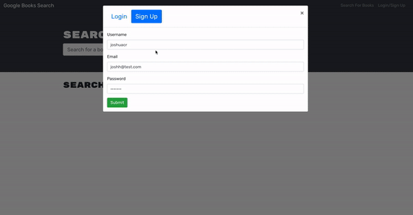

# Google Book Search Engine

## Description
Google book search engine is a full-stack application that uses MongoDB, Express.js, React, and Node.js. It introduces GraphQL and the Apollo Server to fetch and modify data, replacing the existing RESTful API.

## Languages
* MongoDB
* Mongoose
* Express.js
* React
* GraphQL
* Apollo Server and Client
* Node.js
* Javascript
* HTML/CSS

## Deployed Application
https://agile-reef-36729.herokuapp.com/ 

## Reference Images

